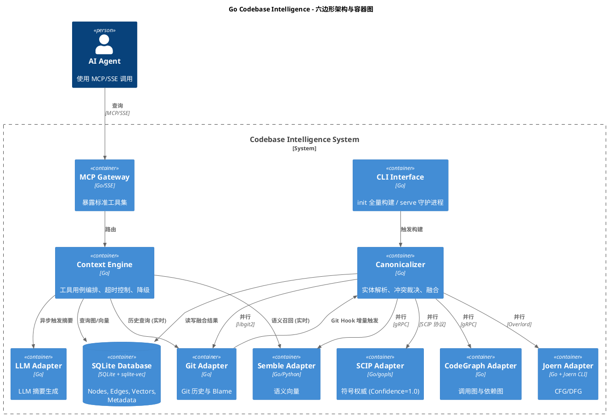

# Go Codebase Intelligence 系统设计文档 (v2.0 Final)

**版本**：2.0 (设计树封闭)
**状态**：已确认
**目标**：为 AI Agent 提供大型 Go 代码库的结构化、语义化与历史感知能力，通过 MCP 协议暴露服务。
**决策记录**：22 个决策点已全部确认，覆盖领域范围、架构风格、构建管道、融合策略、查询契约、向量与 LLM 集成、性能目标、安全与运维。

---

## 目录

1. [术语表](#1-术语表)
2. [架构概览](#2-架构概览)
3. [核心领域模型](#3-核心领域模型)
4. [基础设施与持久化](#4-基础设施与持久化)
5. [工具集成与融合策略](#5-工具集成与融合策略)
6. [操作流程](#6-操作流程)
7. [MCP 工具契约](#7-mcp-工具契约)
8. [LLM 集成](#8-llm-集成)
9. [性能与降级](#9-性能与降级)
10. [安全与运维](#10-安全与运维)
11. [设计树决策记录](#11-设计树决策记录)
12. [实现补充记录（v2.1）](#12-实现补充记录v21)

---

## 1. 术语表

采用领域驱动设计（DDD）战术模式定义通用语言。

| 术语 | DDD 模式 | 定义 | 系统体现 |
| :--- | :--- | :--- | :--- |
| **Codebase Intelligence** | 领域 | 代码库智能分析的目标领域 | 整个系统的业务范围 |
| **Code Entity** | 聚合根 | 代码库中唯一可标识的概念：函数、结构体、文件、包等 | `nodes` 表记录 |
| **Fact** | 实体 | 连接两个 Code Entity 的关系，有唯一性（源、目标、类型） | `edges` 表记录（如 CALLS, IMPORTS, MODIFIED_BY） |
| **Canonical ID** | 值对象 | 内部唯一标识 Code Entity 的标准化字符串 | 格式：`symbol:go:<pkg_path>:<name>`，由 Canonicalizer 生成 |
| **Source Range** | 值对象 | 代码在文件中的起始行与结束行 | `line_start` / `line_end` 列 |
| **Confidence Score** | 值对象 | Fact 的可靠性，0.0~1.0 | `edges.confidence` 列，SCIP 为 1.0 |
| **Code Graph** | 聚合 | 由 Code Entity、Fact 和元数据组成的内部图 | 整个 SQLite 数据库实例 |
| **Index Orchestrator** | 领域服务 | 编排全量/增量构建流程的无状态服务 | 协调 Git Hook、工具调用顺序、批次提交 |
| **Entity Resolution** | 领域服务 | 处理跨工具 ID 映射和冲突解决的规则引擎 | Canonicalizer 组件 |
| **Impact Analysis** | 领域服务 | 基于图遍历计算代码变更影响范围的算法 | 深度 ≤3 的递归 CTE 查询 |
| **MCP Tool Service** | 应用服务 | 对外暴露的 MCP 接口实现层 | 实现 explore_symbol 等工具 |
| **Vector Repository** | 仓储 | 向量嵌入存储与检索 | `semble_vectors` 表 |
| **Code Index Repository** | 仓储 | Node 和 Edge 的 CRUD 及图查询 | SQLite 的 nodes/edges 表 |
| **Build Metadata** | 实体 | 记录每次构建（全量/增量）的执行状态 | `build_metadata` 表 |
| **Build Completed** | 领域事件 | 一次构建成功或降级完成时触发 | 触发 MCP 服务热加载 |
| **LLM Enrichment Requested** | 领域事件 | Agent 查询缺少语义摘要时触发 | 后台队列生成摘要 |
| **Port** | 六边形架构端口 | 系统与外部工具交互的抽象接口 | IndexerPort, HistoryPort, LLMPort |
| **Adapter** | 六边形架构适配器 | 特定外部工具的实现 | SCIPAdapter, CodeGraphAdapter 等 |

---

## 2. 架构概览

系统严格遵循六边形架构，将核心领域与外部工具和交互机制隔离。

### 2.1 设计原则

- **工具不可知**：所有外部分析器通过 Port/Adapter 接入，核心领域不依赖具体实现。
- **降级运行**：任何工具故障都不影响核心查询能力，总是返回部分结果而非错误。
- **单一职责存储**：SQLite 单文件存储所有数据（图、向量、元数据），简化部署。
- **只读 MCP**：外部 Agent 仅能查询，写操作（构建）由 CLI 或 Git Hook 触发。
- **延迟加载**：LLM 摘要按需生成，不阻塞构建管道。

### 2.2 容器级架构图 (PlantUML)



### 2.3 ASCII 部署架构

```
+------------------------------------------------------------------+
|  AI Agent (Codex/Claude)                                         |
+------------------------------+-----------------------------------+
                               | MCP/SSE
                               v
+------------------------------+-----------------------------------+
|  codeintel serve              |                                   |
|  + MCP Gateway (SSE)        |                                   |
|  + Context Engine           |                                   |
|  + Canonicalizer (增量时)    |                                   |
+------------------------------+-----------------------------------+
                               |
                               v
+------------------------------+-----------------------------------+
|  SQLite DB (WAL mode)        |  .codeintel/codeintel.db         |
|  + sqlite-vec               |                                   |
+------------------------------+-----------------------------------+
```

- **部署形态**：单一 Go 二进制文件，无外部依赖（除工具适配器运行时，如 gopls, Joern）。
- **多仓库**：每个仓库一个 `codeintel serve` 实例，数据库在仓库根 `.codeintel/` 下。

---

## 3. 核心领域模型

### 3.1 聚合：Code Graph

**聚合根**：`CodeEntity`

属性：
- `id` (Canonical ID): 值对象
- `kind`: 枚举 (FILE, PACKAGE, FUNCTION, METHOD, STRUCT, INTERFACE, COMMIT)
- `name`: 字符串
- `file_path`: 文件路径
- `line_start` / `line_end`: Source Range 值对象
- `properties`: JSON，包含 `signature`, `doc_comment`, `llm_summary` 等

**实体**：`Fact`

属性：
- `source_id` / `target_id`: CodeEntity.id
- `kind`: 枚举 (CALLS, IMPORTS, DEPENDS_ON, IMPLEMENTS, MODIFIED_BY, REFERENCES, DATA_FLOWS_TO, TESTS)
- `tool_source`: 字符串 (SCIP, CODEGRAPH, JOERN, GIT)
- `confidence`: 0.0~1.0
- `metadata`: JSON (如 `line_num`)

**规约 (Specification)**：
- **ImpactAnalysisSpecification**：深度 ≤3，仅返回 confidence ≥ 0.85 的边（默认）。

### 3.2 领域事件

1. **`BuildInitiated`**：全量或增量构建开始。
2. **`FileDeltaProcessed`**：增量中单个文件处理完成，触发依赖包 stale 标记。
3. **`LLMEnrichmentNeeded`**：摘要缺失，放入后台队列。
4. **`BuildCompleted`**：构建结束，写入 `build_metadata`，通知 MCP 服务热更新。

---

## 4. 基础设施与持久化

### 4.1 SQLite Schema

```sql
-- 节点表
CREATE TABLE nodes (
    id TEXT PRIMARY KEY,  -- Canonical ID
    kind TEXT NOT NULL,
    name TEXT NOT NULL,
    file_path TEXT,
    line_start INTEGER,
    line_end INTEGER,
    properties JSON,
    created_at INTEGER DEFAULT (strftime('%s', 'now'))
);

-- 生成列与索引
ALTER TABLE nodes ADD COLUMN signature_text TEXT 
    GENERATED ALWAYS AS (json_extract(properties, '$.signature')) VIRTUAL;
CREATE INDEX idx_nodes_file_kind ON nodes(file_path, kind) WHERE file_path IS NOT NULL;
CREATE INDEX idx_nodes_name ON nodes(name);
CREATE INDEX idx_nodes_signature ON nodes(signature_text);

-- 边表
CREATE TABLE edges (
    id INTEGER PRIMARY KEY AUTOINCREMENT,
    source_id TEXT NOT NULL,
    target_id TEXT NOT NULL,
    kind TEXT NOT NULL,
    tool_source TEXT NOT NULL,
    confidence REAL NOT NULL DEFAULT 0.5,
    metadata JSON,
    FOREIGN KEY (source_id) REFERENCES nodes(id) ON DELETE CASCADE,
    FOREIGN KEY (target_id) REFERENCES nodes(id) ON DELETE CASCADE
);
CREATE INDEX idx_edges_source ON edges(source_id);
CREATE INDEX idx_edges_target ON edges(target_id);
CREATE INDEX idx_edges_kind ON edges(kind);
CREATE INDEX idx_edges_confidence ON edges(confidence) WHERE confidence >= 0.8;

-- 向量表 (sqlite-vec 扩展)
CREATE VIRTUAL TABLE semble_vectors USING vec0(
    id TEXT PRIMARY KEY,      -- = nodes.id
    embedding FLOAT[768]
);

-- 构建元数据
CREATE TABLE build_metadata (
    build_id TEXT PRIMARY KEY,
    commit_sha TEXT,
    tool_name TEXT,           -- 'all' (全量) 或 'incremental'
    status TEXT,              -- 'success', 'degraded', 'failed'
    duration_ms INTEGER,
    error_message TEXT,
    timestamp INTEGER DEFAULT (strftime('%s', 'now'))
);
CREATE INDEX idx_build_commit ON build_metadata(commit_sha);
```

### 4.2 仓储接口 (Go 风格)

```go
type CodeRepository interface {
    SaveNode(node *CodeEntity) error
    SaveEdges(edges []*Fact) error
    DeleteByFile(filePath string) error
    GetSymbol(id CanonicalID) (*CodeEntity, error)
    GetCallers(id CanonicalID, depth int, minConfidence float64) ([]*Fact, error)
    GetCallees(id CanonicalID, depth int, minConfidence float64) ([]*Fact, error)
    GetImpact(id CanonicalID, depth int) ([]*CodeEntity, error)
}

type VectorRepository interface {
    Search(embedding []float32, limit int) ([]EntityScore, error)
    Upsert(id string, embedding []float32) error
}

type BuildMetadataRepository interface {
    Save(meta *BuildMetadata) error
    GetLatest() (*BuildMetadata, error)
}
```

---

## 5. 工具集成与融合策略

### 5.1 适配器与置信度

| 工具 | 作用 | 置信度 | 数据种类 |
| :--- | :--- | :--- | :--- |
| SCIP (gopls) | 精确符号、引用、定义 | 1.0 | 符号表、引用边 |
| CodeGraph | 调用图、包依赖 | 0.8 | 调用边、导入边 |
| Joern | 控制流、数据流 | 0.7 | 数据流边 |
| Git | 提交历史、blame | 1.0 | MODIFIED_BY 边 |
| Semble | 语义向量 | N/A | 向量嵌入 |

### 5.2 并行构建流程

全量构建：
1. Orchestrator 启动所有适配器 goroutine。
2. 每个适配器有独立超时 (10 分钟)。
3. 适配器流式返回原始数据到 Canonicalizer。
4. Canonicalizer 实时处理：生成 Canonical ID，写入数据库（分批 1000 条事务）。
5. 若某适配器超时或失败，其已提交数据保留，标记降级。
6. 构建结束写入 `build_metadata`，status = degraded 如果至少一个失败，failed 如果 SCIP 或 Git 失败。

增量构建：
1. Git post-receive hook → HTTP POST 到 `codeintel serve`。
2. Orchestrator 获取 `git diff --name-only`。
3. 对每个变更文件：
   - BEGIN TRANSACTION
   - DELETE FROM nodes WHERE file_path = ?
   - 并行调用适配器（仅针对该文件），提取数据。
   - Canonicalizer 处理并插入新数据。
   - 标记直接 import 此文件的包为 stale。
   - COMMIT（即使 Joern/CodeGraph 失败也不回滚 SCIP 数据）。
4. 异步处理 stale 包刷新（后台队列，1 分钟内完成）。

### 5.3 实体解析与冲突裁决

- **Canonical ID 生成**：`symbol:go:<import_path>:<name>`。对于函数/方法，name 含接收者标识。
- **同义边合并**：若多个工具报告相同 source → target 且同 kind，保留最高置信度边，tool_source 标记为最高置信度工具。
- **视角互补**：不同分析维度（如静态调用 vs 运行时数据流）的边共存，不视为冲突。
- **真正冲突**：同一维度（如静态调用）结论矛盾时，取高置信度边，低置信度边不写入。

---

## 6. 操作流程

### 6.1 全量构建 CLI

```shell
codeintel init --repo /path/to/repo
```
过程：见时序图（略）。最终输出构建报告：符号数、边数、降级状态、耗时。

### 6.2 增量更新 (自动)

- Git hook 调用：`POST http://localhost:<port>/incremental`
- 负载：`{"ref": "refs/heads/main", "before": "...", "after": "..."}`
- 守护进程异步执行增量构建，立即返回 202 Accepted。
- 构建完成后触发 MCP 热更新（重新打开数据库或清除缓存）。

### 6.3 Agent 查询流程 (MCP)

1. Agent 发送工具调用。
2. Context Engine 解析参数，设置 3 秒硬超时。
3. 执行查询，如有必要触发 LLM 摘要异步生成。
4. 返回结果，包含可能的部分数据和 `degraded` 标记。

---

## 7. MCP 工具契约

### 7.1 `explore_symbol`

**输入**：
```json
{
  "symbol_id": "symbol:go:payment/service.go:CreatePayment",
  "include_details": false
}
```

**输出 (摘要层)**：
```json
{
  "symbol": {
    "id": "...",
    "name": "CreatePayment",
    "kind": "function",
    "package_path": "payment",
    "file": "payment/service.go",
    "line_start": 42,
    "line_end": 87,
    "signature": "func (s *Service) CreatePayment(req Request) error",
    "callers_count": 5,
    "callees_count": 8,
    "summary": "处理支付创建，验证请求并调用支付网关...",
    "degraded": false
  }
}
```

**输出 (详情层)**：增加：
```json
{
  "callers": [ { "id": "...", "name": "HandleRequest", "kind": "function", "file": "api/handler.go" } ],
  "callees": [ ... ],
  "tests": [ ... ]
}
```
callee/caller 列表上限 50 条，超出则 `truncated: true`。

### 7.2 `impact_analysis`

**输入**：
```json
{
  "symbol_id": "...",
  "depth": 3,
  "include_data_flow": true
}
```
**输出**：
```json
{
  "root": "...",
  "total_affected": 12,
  "nodes": [ ... ],
  "edges": [ ... ],
  "truncated": false,
  "execution_time_ms": 280,
  "degraded": false
}
```

### 7.3 `trace_data_flow`

- 完全依赖 Joern。若 Joern 数据缺失，返回空数据且 `degraded: true`。
- 路径表示：`source_var -> node1 -> node2 -> sink_var`。

### 7.4 `codebase_search`

- 输入自然语言查询，通过 Semble 适配器实时向量化，从 `semble_vectors` 检索 Top 10 相似 Code Entity。
- 返回 ID、name、file_path、相似度分数。

### 7.5 `find_tests`

- 基于 `TESTS` 边（隐式或命名约定反向追踪）。返回测试函数列表。

---

## 8. LLM 集成

- **端口**：`LLMPort` 接口，`GenerateSummary(code *CodeEntity) (string, error)`。
- **适配器**：初始实现对接 OpenAI 兼容 API，通过配置切换模型。
- **触发**：查询时若 `llm_summary` 缺失，发布 `LLMEnrichmentNeeded` 事件，异步执行，不阻塞查询。
- **缓存**：生成后写入 `properties.llm_summary`，后续直接返回。
- **内容**：200 字内，包含核心职责、参数/返回值、副作用、领域语义。
- **限制**：全量构建时不生成，仅按需。

---

## 9. 性能与降级

### 9.1 性能目标

| 操作 | 目标 | 硬超时 |
| :--- | :--- | :--- |
| explore_symbol (摘要) | <100ms | 3s |
| explore_symbol (详情) | <300ms | 3s |
| impact_analysis (depth 3) | <500ms | 3s |
| codebase_search | <300ms | 3s |
| 增量构建（单文件） | <1min | 5min (放弃降级) |
| 全量构建 | 无硬性限制，10 万符号仓库约 5 分钟 | 适配器级 10min |

### 9.2 降级策略矩阵

| 场景 | 行为 |
| :--- | :--- |
| SCIP 失败 | 构建失败 (status=failed)，无法提供任何符号查询 |
| Git 失败 | 构建降级，历史信息缺失，其他正常 |
| CodeGraph 失败 | 构建降级，调用图缺失，影响分析基于 SCIP 引用 |
| Joern 失败 | 构建降级，数据流/trace 不可用 |
| Semble 失败 | 构建降级，语义搜索不可用 |
| 查询超时 | 返回已收集的部分结果，标记 truncated |
| 大文件 (>5000行) | Joern 降级为仅提取函数签名，跳过完整 CFG |

---

## 10. 安全与运维

### 10.1 安全模型

- **网络假设**：系统运行在受信内网，无内置认证。
- **传输安全**：若需跨网络，依赖反向代理提供 TLS 和认证 (mTLS/API Key)。
- **MCP 只读**：所有工具仅查询，无副作用。构建仅由 CLI 或本地 hook 触发。
- **文件系统访问**：仅限仓库内，不遍历外部路径。

### 10.2 部署运维

- **多仓库隔离**：每个仓库一个 `serve` 实例，数据库在 `.codeintel/codeintel.db`。
- **数据清理**：`codeintel clean` 删除数据库和缓存。
- **版本迁移**：v1.0 前无自动迁移，需手动重建。检测 schema 版本不匹配时提示。
- **日志**：结构化 JSON 输出到 stdout，`--verbose` 调整级别。
- **仓库缓存路径**：`$XDG_CACHE_HOME/codeintel/repos/` 存放克隆仓库。

---

## 11. 设计树决策记录

共 22 个决策点，分 5 轮确认：

**第一轮 (基础层)**
1. 领域范围：仅 Go 代码库，静态分析。
2. 六边形架构：Port/Adapter 隔离外部工具。
3. 存储：SQLite + sqlite-vec，无外部依赖。
4. 部署：单一二进制，serve 同时提供 MCP 和增量接口。
5. MCP 工具：5 个只读工具，不含原始 Git 接口。

**第二轮 (构建与增量)**
6. 全量构建：并行适配器，独立超时，失败标记降级。
7. 增量构建：文件级全量替换，事务提交，stale 包异步刷新。
8. 降级运行：MCP 工具永不抛错，返回部分结果 + degraded。

**第三轮 (融合与查询)**
9. 冲突解决：合并同边取最高置信度，不同视角共存。
10. 置信度阈值：默认 0.85，Agent 可要求全量。
11. explore_symbol 分层：摘要含 kind/pkg/signature，详情轻量引用。
12. 构建元数据：每次构建一条记录，status 三态。

**第四轮 (向量与 LLM)**
13. 向量嵌入：构建时同步生成，粒度 = CodeEntity，ID 一对一。
14. LLM 摘要：延迟生成，后台异步，LLMPort 抽象。
15. 摘要内容：200 字，含职责/参数/副作用/领域语义。
16. 性能目标：查询分档目标，3s 硬超时。
17. 大文件：>5000 行 Joern 降级，详情列表截断 50 条。

**第五轮 (运维与边界)**
18. 故障处理：流式部分数据提交不回滚，无自动重试。
19. 安全：受信环境，无认证，只读 MCP。
20. 多仓库：单实例单仓库，多进程隔离。
21. 版本迁移：v1.0 前重建，后续考虑迁移命令。
22. 未覆盖项：日志、缓存路径作为实现细节。

---

**文档结束**。所有架构决策已达成共享理解，系统可进入开发阶段。
## 12. 实现补充记录（v2.1）

v2.0 设计树封闭后，MVP 实现过程中补充与调整的能力记录。凡与 v2.0
正文冲突处，以本节为准。

### 12.1 新增 CLI 命令

| 命令 | 说明 |
| :--- | :--- |
| `codeintel init --repo <path>` | 全量构建（v2.0 已有） |
| `codeintel serve --repo <path> [--addr :8090]` | 图探索 Web 服务（HTTP API + 内嵌前端） |
| `codeintel query symbol\|callers\|callees\|impact` | 符号与调用关系查询（CLI 验收要求，v2.0 未定义 CLI 查询） |
| `codeintel clean --repo <path>` | 删除索引数据库 |
| `codeintel version` | 输出编译时的 commit hash（Makefile ldflags 注入，兜底 debug.ReadBuildInfo） |

### 12.2 顶层入口识别（roots）

入口 = main 函数 + 服务入口 + 框架回调 struct，且必须落在当前 module
内的文件（file_path 非空、非 `_test.go`、非仓库外路径）。

1. **main 入口**：各 main 包的 main 函数（排除测试生成的 main）。
2. **HTTP 服务入口**（`serves_http` 标记）：
   - 函数调用 net/http 包（含 `srv.ListenAndServe()` 等方法调用）
   - 实现 `http.Handler` 接口的类型（ServeHTTP 方法，值/指针接收者均可）
   - `http.Handle` / `http.HandleFunc`（含 mux.Handle）的 handler 参数
     （具名函数或 `http.HandlerFunc(f)` 包装）
3. **gRPC 服务入口**（`serves_grpc` 标记）：
   - 函数调用 google.golang.org/grpc 包
   - 调用 `.pb.go` 中定义的 `RegisterXxxServer`（protoc 生成惯例）的函数
   - **注册调用的第二个参数（服务实现）**：`&T{}` 复合字面量 /
     `newT()` 构造函数 / 变量，解析为具体类型作为顶层服务入口
4. **框架回调 struct**：带方法的 struct，其方法未被当前 module 其他
   文件调用（无跨文件 CALLS 入边）→ 推测由框架注册/回调调用，作为顶层。
   判定原因逐条输出 INFO 日志。
5. **init() 不作为入口**（v2.0 曾计划，实现后移除：框架注册由 2-4 覆盖）。

### 12.3 图探索前端（AntV G6 v5）

- **入口选择**：首页不再展示全部顶层节点，通过带搜索的下拉框选择
  入口后展示（列表来自 /api/roots，输入实时过滤）。不再有
  "展开顶层节点后删除其他节点"的聚焦逻辑（v2.1 曾实现，后移除）。
  入口节点首次选择后置于**画布正中**（addNode 网格预置位置在左上角，
  force 布局不移动孤立节点，须显式 updateNodeData 居中）。
- **交互**：单击选中节点（右侧信息栏展示详情）；双击展开/收起依赖；
  单击空白取消选中并复位信息栏。
- **节点配色**：每种类型一种颜色——函数蓝 #1677ff、方法青 #13c2c2、
  结构体绿 #52c41a、接口紫 #722ed1、包橙 #fa8c16、文件灰 #8c8c8c、
  提交深灰 #595959、对象薄荷绿 #00b96b；入口标记色（main/http/grpc/
  framework）为描边色不受影响。右上角"节点类型 ▾"下拉展示每种颜色
  对应类型（由 KIND_COLOR/KIND_LABEL 生成，点击外部关闭）。
- **右侧节点信息栏**（常驻侧边栏，默认 320px，**可拖拽调整宽度**
  240–520px，CSS 变量 --panel-w 联动画布右边界，拖拽结束重排居中）：单击节点后分组展示——
  基本信息（名称/类型/文件/签名/标记/ID）、**字段表**（struct 节点，
  字段名 | 类型，来自 properties.fields）、文档注释
  （properties.doc_comment）、提交信息（commit 节点的 message/date）、
  关系（按类型分组：调用/实现/导入/初始化/使用/传给/类型/数据流，
  每组内**按对方节点文件路径分组**（组头为文件路径，条目显示方向
  →/←、对方节点、行号）；**调用拆分为两组**：调用（N）= callee
  出边、被调用（N）= caller 入边；**接收者关系按视角拆分**：出边
  显示"接收者（N）"（方法节点视角）、入边显示"方法（N）"（struct
  节点视角，即它的方法们））。数据复用 /api/expand（node+edges+
  neighbors），后端 NodeJSON 补充 doc_comment/message/date/fields
  字段。
- **分组 [隐藏] 按钮**（2026-08-13）：信息栏关系分组标题带 [隐藏]
  按钮——点击隐藏该分组涉及的节点（collectSubtree 清理 + setData
  重建 + 增量重排 + 显式 graph.draw() + 刷新信息栏）；**曾展开过
  （expandedMap 有记录）的节点保留**。分组→节点 id 映射存于
  panelGroupNodes（渲染时按分组索引记录）。**坑**：setData 后不自动
  渲染，须 draw()——否则隐藏要等下次状态变化（点空白）才可见。
- **struct 展开过滤方法**（2026-08-13）：展开 struct 节点时不展示
  它的方法们（has_method 出边邻居与边过滤）——方法是 struct 的
  细节，探索链时避免其它方法涌入；已在图中的方法不受影响。
- **Source Code 弹窗**：函数/方法节点信息栏顶部有 Source Code 按钮，
  点击弹窗展示完整源码（`/api/source?id=`）。后端按需读取仓库文件并
  go/parser 定位声明提取源码区间（匹配策略：LineStart 精确 → 行范围
  包含 → 名称匹配（方法名 (T).m 解析接收者），文件修改后行号漂移仍可
  定位）；只允许 function/method 且防目录穿越（解析结果必须在仓库根内）。
  前端用 highlight.js（CDN，GitHub 主题）Go 语法高亮，CDN 未加载时
  降级纯文本。
  **布局坑**：G6 v5 会给容器设内联 `position:relative`，覆盖样式表的
  absolute 定位，`right:320px` 不收缩宽度——需外层 #main-area 承担
  定位让出右侧空间（容器 100% 填充）。
- **三行布局**：展开后按三行排布——上行 = callers（calls 入边）、
  中间行 = 节点本身 + 非 calls 关联（implements/imports/initializes
  等）、下行 = callees（calls 出边）。展开后不跑 force 布局
  （避免覆盖三行位置），其他已展开节点位置不动。
- **同向剪枝**（2026-08-13 修正）：展开节点时只移除与它同侧（同方向）
  的兄弟——展开 callee 移除其他 callee（保留 caller，链路顶行不消失），
  展开 caller 移除其他 caller（保留 callee）；已展开的兄弟保留；方向
  无法判断时退回移除全部。方向分类与三行布局一致（rowClass：
  calls/initializes 出=down，implements/imports 出=up，其余=mid）。
  此前为"移除全部未展开兄弟"，展开 callee 会把唯一顶行 caller（如
  cmdInit）也剪掉导致链路断头（用户实测反馈后修正）。
- **展开过滤只拦 calls 入边**（2026-08-13 修正）：有父节点时展开，
  "过滤其他父"仅针对 calls 入边（潜在 caller）；has_method/
  implements/initializes 等入边是节点的关联须展示——否则双击接收者
  节点（struct）时它的方法们全部被拦掉，什么都展开不出来。
- **过滤按方向区分**（2026-08-13 修正）：展开 down/mid 类节点时过滤
  其他调用方（保持向下链式展开干净，用户此前确认）；展开 up 类
  （caller）节点时**不过滤**——展示它的调用方让链向上延伸（如展开
  cmdInit 显示 Main：Main → cmdInit → FullBuild → ...）。
- **收起孤儿判断顺序**（2026-08-13 修正）：collectCollapse 先递归回收
  整棵子树的展开记录（edgesToRemove 完整）再做孤儿判断——原实现边
  回收边判断，先处理的子节点会把连到后处理兄弟新增边的边误判为
  "有其他边"而残留（收起根后 flush 残留）。
- **方向感知树布局**（2026-08-13 修正）：非根展开/收起后的整树布局
  （relayoutTree）按行号分层：根=0，**箭头始终向下**——child 通过任意
  关系指向 parent（child 是边的 source：caller/接收者/接口，isUp）在
  其父**上一行**，parent 指向 child 在下一行；每行水平居中。保证链路
  垂直——展开 callee 后 cmdInit 始终居中在 FullBuild 正上方。
- **箭头方向统一原则**（2026-08-13）：所有关系类型（calls/has_method/
  implements/initializes）的布局方向一致——**source 在上、target 在下**
  （接收者在上、接口在上、调用方在上）。曾只对 calls 判方向，has_method
  入边（接收者）和 implements 入边（接口）被排到下方、箭头朝上（示例
  图 A→C→G 向上展开复现）；三行布局（arrangeLayers）/rowClass/树布局/
  tail 定位全部统一按边方向。
- **增量布局**（2026-08-13 修正）：展开时已有节点保持原位置，新节点行
  在相邻已知行之间插值——向上展开（出现更上层调用方）不再把整棵树
  往下推（用户确认）。prevY 须在 addNode **之前**收集（否则新节点的
  网格初始位置被当成已有位置）；新行超出画布顶部时 updateNodeData
  动画完成后（setTimeout 500ms，updateNodeData 无返回）fitView 自适应。
  收起仍走全量重排。
- **无记录节点按边定位**（2026-08-13 修正）：不在展开树中的节点（如
  剪枝后作为其它节点邻居重新出现的父节点）不再一律追加最后一行——
  按与已分层节点的边关系定位：calls 出边（该节点是 caller）在其上一
  行、其余下一行，保证**箭头始终向下**（父节点不会掉到底部）；无法
  定位的才追加最后一行。
- **全量重排分层兜底**（2026-08-13 修正）：增量布局改造时全量重排
  （无 prevY，如收起）的兜底写坏——所有深度行都落在 startY=80，
  收起后全部节点堆在同一行、箭头全"向上"（审计探针 12 步序列
  复现）。修复：无 prevY 时按 minD 偏移分层（与旧全量布局一致）。
- **边方向修正**（2026-08-13 修正）：BFS/tail 只沿展开树定深度，共享
  节点（如 BuildMeta 既是 FullBuild 的初始化对象、又被传给 Save）的
  行号可能与其它边方向冲突（passes_to 箭头向上）。修复：深度计算后
  对图中所有边做循环修正（source 深度 < target 深度）；修正触发时
  prevY 已与新深度错位（如 BuildMeta 从 1 行提到 0 行但 prevY 还是
  旧行，rowY[0] 被旧位置占据导致同层）——此时放弃"已有节点不动"，
  整树按新深度干净分层；行数变多超出画布底部时也触发 fitView。
- **剪枝隐藏关系可配置**（2026-08-13）：header"隐藏规则 ▾"下拉勾选
  展开时要隐藏的关系类型（调用/方法/实现/初始化/导入/使用/传给/
  类型/数据流），选择持久化到 localStorage（codeintel.hideKinds）；
  默认仅"调用"。剪枝移除"同侧且属于勾选关系"的兄弟，未勾选的关联
  （如接收者/接口）即使同侧也不隐藏。
- **方法线 has_method**（2026-08-13，曾为 has_receiver 后反转）：接收者
  类型 → 方法（用户确认方向：由接收者指向方法）。AST 适配器
  （emitMethodReceiver）为每个带 receiver 的方法声明建立 has_method
  边，接收者类型节点如不存在则创建（轻量节点，SCIP 已建则 UPSERT
  合并）；Expand 查询与前端边样式（虚线 [5,2]、标注"方法"）、信息栏
  分组均已加入。信息栏按视角拆分：struct 节点出边显示"方法（N）"、
  方法节点入边显示"接收者（N）"。反转后旧 has_receiver 边不残留
  （kind 更名，重建时 clean 清库）。**布局坑**：中间行只有单个节点
  （如接收者）时 placeRow 会把它放在中心节点正上方导致重叠——单个
  mid 节点须偏移到中心右侧（offsetSingle）。
- **implements 方向**（2026-08-13 反转）：接口 → 实现者（用户确认：
  接口要指向实现，而非实现指向接口）。SCIP 适配器 is_implementation
  关系反转 Source/Target；前端三行布局/rowClass 的 implements 分类对调
  （接口出边=实现者下行、实现者入边=接口上行）；信息栏按视角拆分：
  接口节点出边显示"实现者（N）"、实现者节点入边显示"实现（N）"。
- **接口作为整体节点**（2026-08-13 修正）：接口方法（如 (F).C）不建
  独立节点，implements 边只连接接口类型 → 实现者类型。区分依据：
  SCIP descriptor 链 desc[2] 为 Term 是接口方法（Payer#CreatePayment.）、
  Method 是实现方法（Service#CreatePayment().）；AST 适配器调用接口
  方法时也不建节点/不建调用边（isInterfaceMethod：接收者类型是接口）。
- **选中染色**：单击节点后，其出边蓝色 `#1677ff`、入边红色 `#f5222d`，
  其他边及未选中时黑色。
- **节点标签（三行）**：第一行文件所在目录 + basename（如
  `orchestrator/orchestrator.go`），第二行方法接收者 `(T)` / 函数
  包名 `(pkg)`（从 canonical ID 提取），第三行方法名 / 函数名；
  无文件信息节点（commit 等）单行显示符号名。字号 10。
- **G6 v5 setElementState 异步绘制坑**（2026-08-13 实测）：选中切换
  （A→B）必须先更新 selectedId 再调用 setElementState。setElementState
  内部 await element.draw，样式函数在绘制时才求值（读闭包 selectedId）：
  若先 setElementState(旧节点,[]) 再更新 selectedId，旧染色的异步绘制
  后完成并覆盖新染色——大图中快速点击稳定复现（14 节点图 13/14 次出错），
  点空白才重置。
- **边样式**：实线=调用，虚线=实现，点线=导入；边上标注关系说明。
- **G6 v5 已知坑**（playwright 实测）：
  - `draw()` 不触发布局，增量数据须显式 `graph.layout()`
  - force 布局不处理孤立节点与增量新节点 → addNode 预置网格初始位置
  - `updateEdgeData`/`draw`/`setData` 不重算渲染期样式函数 →
    染色用 setElementState 状态变化触发重渲染
  - `removeEdgeData`+`removeNodeData` 批处理引用已删节点报
    "Node not found" → 收起用 setData 全量重建
  - 坐标转换 API 参数为数组：`getElementPosition(id)`、
    `getClientByCanvas([x, y])` 返回 `[x, y, z]`

### 12.4 索引范围与数据来源

- **排除 `_test.go`**：scip-go `--skip-tests` + AST 适配器关闭 Tests 模式，
  测试符号（TestXxx、测试 main）不入图。
- **struct 字段**（v2.1 补充）：AST 适配器 emitStructFields 为 struct
  类型声明提取字段列表写入 `properties.fields`（[{name, type}]，类型
  用 go/types 短名——本包无前缀、其他包用包名如 `*domain.Repository`，
  匿名嵌入字段用其类型名；注意 `types.RelativeTo` 对非本包是全限定
  路径，须自定义 qualifier），信息栏以表格展示。
- **对象追踪**（v2.1 补充）：struct 实例化（`&T{}` / `T{}` / 内建
  `new(T)`）的实例**合并到 struct 类型节点**（不建独立对象节点，同一
  类型的实例在图里统一），建立：
  - `initializes`：初始化者函数 → struct 类型（conf 0.8）
  - `uses`：类型实例的方法被调用（`x.Method()`，同一函数内变量追踪，
    conf 0.8）
  - `passes_to`：类型实例被传给其他函数（`f(x)` / `f(&T{})`，conf 0.8）
  构造函数 `newT()` 由 calls 边 + 其内部实例化递归覆盖。仅限 module 内
  struct（排除 map/slice 等复合字面量）；跨函数参数流暂不追踪。
- **函数作为参数传入**（回调）：`mux.HandleFunc("/", handler)` 等场景，
  参数函数（Ident / 方法引用 s.M / `http.HandlerFunc(f)` 解包）→ 接收
  函数（passes_to 边）。接收者可为外部框架函数（如 net/http 的
  HandleFunc），为其建轻量节点（file_path 为空）使关系可见。
- **REFERENCES 引用边未实现**：scip-go 的定义 occurrence 只覆盖符号名
  （不含函数体），引用无法归属到引用者，引用关系由 CALLS 边覆盖。
- **signature 由 AST 适配器生成**（`types.ObjectString`）：SCIP v0.7.1
  协议不输出 signature 字段。
- **canonical ID**：`symbol:go:<import_path>:<name>`，方法统一
  `(T).method`（值/指针接收者不区分）；文件 `file:<relpath>`，
  提交 `commit:<sha>`，包名取路径末段。

### 12.5 置信度阈值（设计矛盾修正）

**查询阈值 0.8**。v2.0 决策 10 的 0.85 与 5.1 表（CodeGraph=0.8）矛盾：
0.85 会把全部调用边过滤掉。调用边（conf 0.8）必须可见，故取 0.8。

### 12.6 日志与链路追踪

- **日志**：zap development logger，debug 级输出到 **stdout**。
- **OpenTelemetry**：logging.Setup 初始化 TracerProvider（stdout 导出器）；
  `logging.FromContext(ctx)` 在 span context 有效时自动附加
  `trace_id`/`span_id` 字段；main 创建 root span 贯穿 CLI。
- **entrylog 工具**：`scripts/entrylog`（AST 只读定位 + 纯文本插入），
  为所有顶层函数/方法注入 `logger := zap.L()`（无 ctx）或
  `logging.FromContext(ctx)`（有 ctx）+ enter/exit Debug 日志；
  幂等可重跑；排除 `internal/logging` 自身与 scripts/。

### 12.7 仍为降级项（v2.0 未实现）

- MCP serve（explore_symbol 等 5 个工具）与 MCP 工具契约
- 增量构建（Git Hook 触发、stale 包刷新）
- **Joern（数据流）**：已接入（v2.1.1）——joern-parse（gosrc2cpg）+
  joern-slice data-flow，产出方法内数据流路径（properties.data_flows）
  与跨方法 DATA_FLOWS_TO 边（conf 0.7）。注意：gosrc2cpg 当前只产出
  方法内 REACHING_DEF（跨方法参数流需 Joern 交互式分析，未接入）；
  大项目切片耗时较长（radar 全量约 8-10 分钟），依赖 PATH 中的
  joern-cli。失败时构建降级（degraded）。
- Semble（语义向量，sqlite-vec 表未建）
- LLM 摘要（LLMPort 未接入）

---

**v2.1 补充结束**。后续变更继续追加本节。
